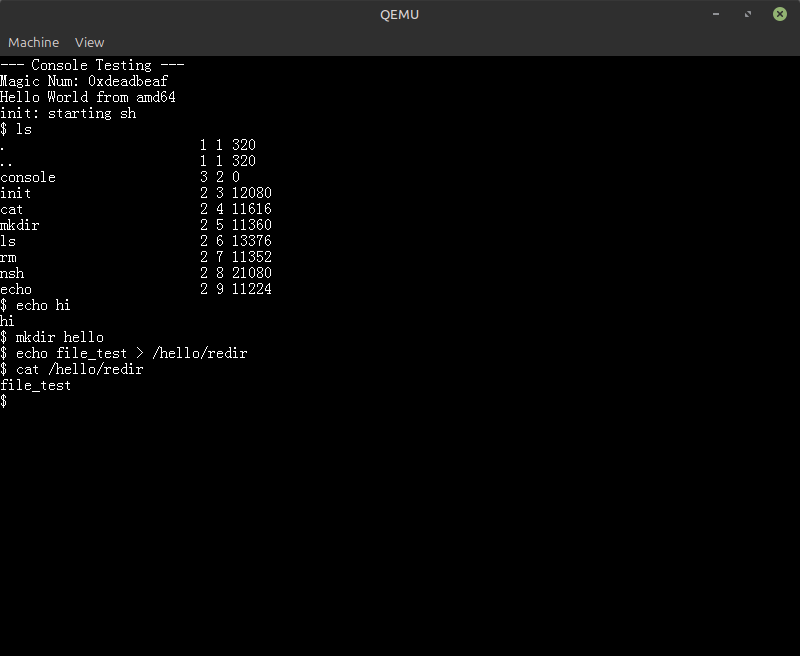
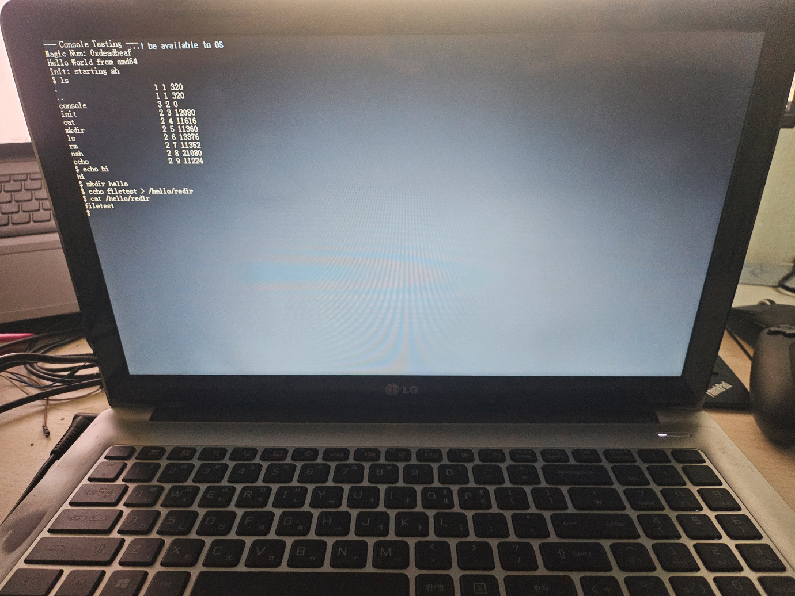
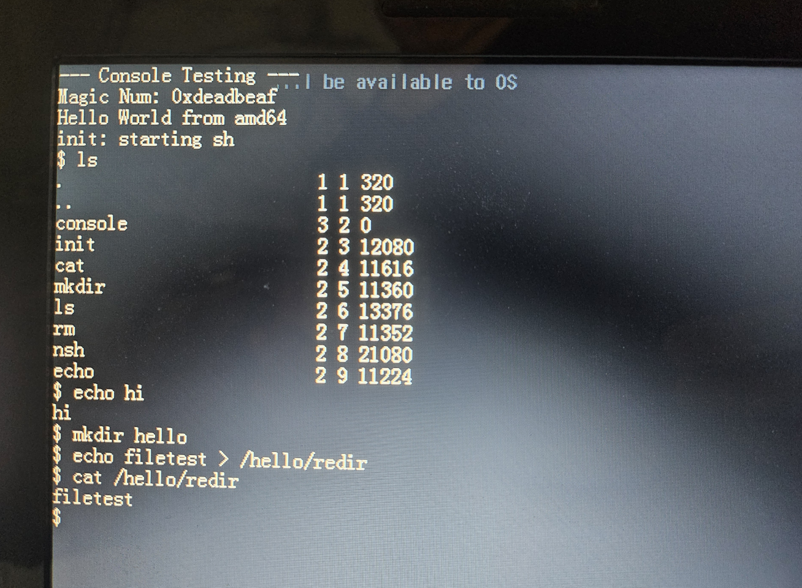

# xv6_64

An amd64 reimplementation or port of `xv6`.

## Key changes
- Bootloader: BIOS to UEFI/GRUB
- Virtual Memory: 
    - From 2-level paging (PD-PT) to 4-level paging (PML4-PDPT-PD-PT)
    - Added a direct physical mapping at `0xFFFF888000000000`, inspired by Linux
- System calls: implemented the `syscall` / `sysret` path instead of `int`
- Console: Serial to GOP Framebuffer, thanks to GRUB
- Bootable on amd64 UEFI machines.

## Build
### Requirements
- gcc
- fasm
- qemu
- grub-mkstandalone
- mtools
- parted
- OVMF
```bash
sudo apt update
sudo apt install gcc fasm qemu-system-x86 grub-efi-amd64-bin mtools parted ovmf
```

## Features

### Done
- Process syscalls: `fork`, `exec`, `wait`, `exit`, `kill`
- FS syscalls: `open`, `close`, `read`, `write`, `dup`, `mkdir`, `unlink`
- User `malloc` via `sbrk`
- User shell with pipelines, lists, background commands, and redirection (...with a little help from the `pipe` syscall)
- Null-page protection, so our code starts from 0x1000, not 0x0 like in `xv6`

### Todo
- A few system calls: `uptime`, `sleep`, `link`
- Full disk support: the buffer cache exists, but the backing storage is still a memory disk
- Multicore support: Most locks and synchronization code exists, but AP startup / trampoline code is not implemented yet

### Our Features to Add
- NVMe Driver
- Signal

### Run in QEMU
```bash
make run
```


for GDB:
```bash
make debug
```

### Run in Real Machine
#### 1. Prepare a USB drive
#### 2. Make an image for USB (`make run` makes the file too)
```bash
make format_usb
```
- It will make `usb.img` under the build dir.- `pipe` syscall
- It is a GPT+ESP+FAT image file, so we need to directly copy the bytes to the USB.
#### 3. Plug in the USB and check the name with `lsblk`
```bash
NAME        MAJ:MIN RM   SIZE RO TYPE MOUNTPOINTS
sda           8:0    1   3.7G  0 disk 
└─sda1        8:1    1    64M  0 part 
nvme1n1     259:0    0 238.5G  0 disk 
├─nvme1n1p1 259:1    0    16G  0 part [SWAP]
└─nvme1n1p2 259:2    0 222.5G  0 part /mnt/data
nvme0n1     259:3    0 476.9G  0 disk 
├─nvme0n1p1 259:4    0   100M  0 part /boot/efi
├─nvme0n1p2 259:5    0    16M  0 part 
├─nvme0n1p3 259:6    0   237G  0 part 
├─nvme0n1p4 259:7    0   824M  0 part 
├─nvme0n1p5 259:8    0 237.8G  0 part /
└─nvme0n1p6 259:9    0   573M  0 part 
```
- Here, my USB drive is `dev/sda`. 
#### 4. Copy the image to the USB
```bash
sudo dd if=build/usb.img of=/dev/sda bs=4M status=progress conv=fsync; sync
```
- **Beware typos, you can damage your own storage.**
#### 5. Eject your USB and boot from it.
- You may need to change the boot sequence of your BIOS/UEFI




## Acknowledgements

This project is derived from the MIT PDOS xv6. Most components follow xv6's design, while this repo ports the system to amd64/UEFI and adds project-specific changes.